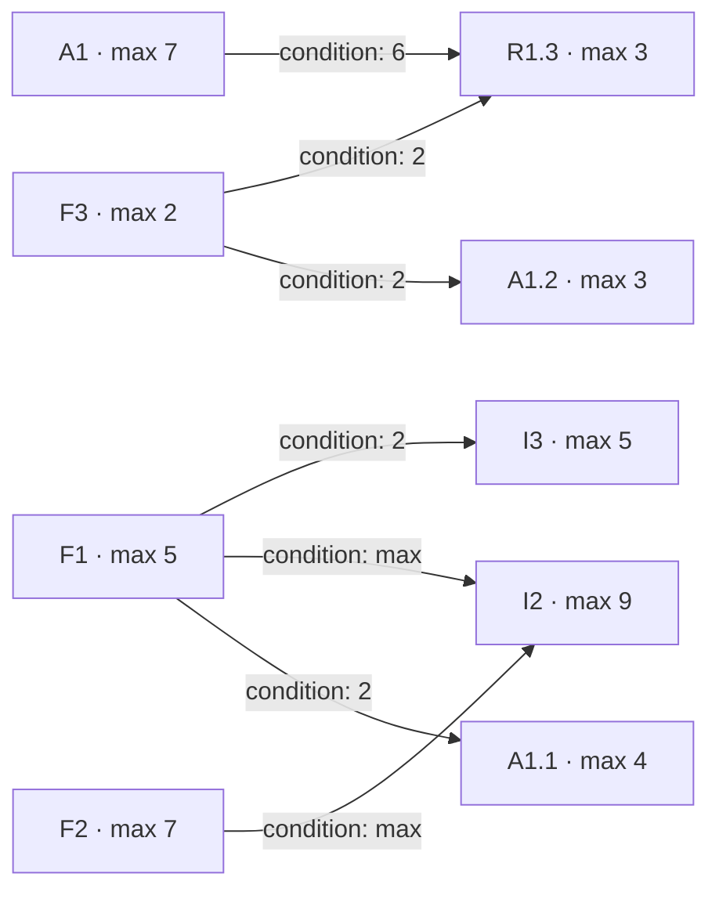

# FAIR Score dependencies

<!-- Generated from definitions/fair.yaml; do not edit directly. -->

Arrows point from the score being depended upon to the score whose evaluation it affects.

```mermaid
flowchart LR
    score_a1["A1 · max 7"]
    score_a1_1["A1.1 · max 4"]
    score_a1_2["A1.2 · max 3"]
    score_f1["F1 · max 5"]
    score_f2["F2 · max 7"]
    score_f3["F3 · max 2"]
    score_i2["I2 · max 9"]
    score_i3["I3 · max 5"]
    score_r1_3["R1.3 · max 3"]
    score_a1 -->|"condition: 6"| score_r1_3
    score_f1 -->|"condition: 2"| score_a1_1
    score_f1 -->|"condition: max"| score_i2
    score_f1 -->|"condition: 2"| score_i3
    score_f2 -->|"condition: max"| score_i2
    score_f3 -->|"condition: 2"| score_a1_2
    score_f3 -->|"condition: 2"| score_r1_3
```
