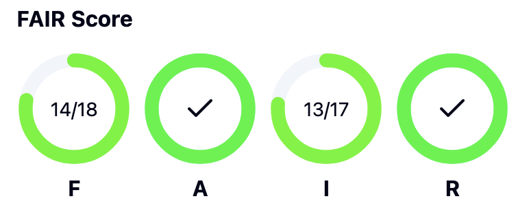
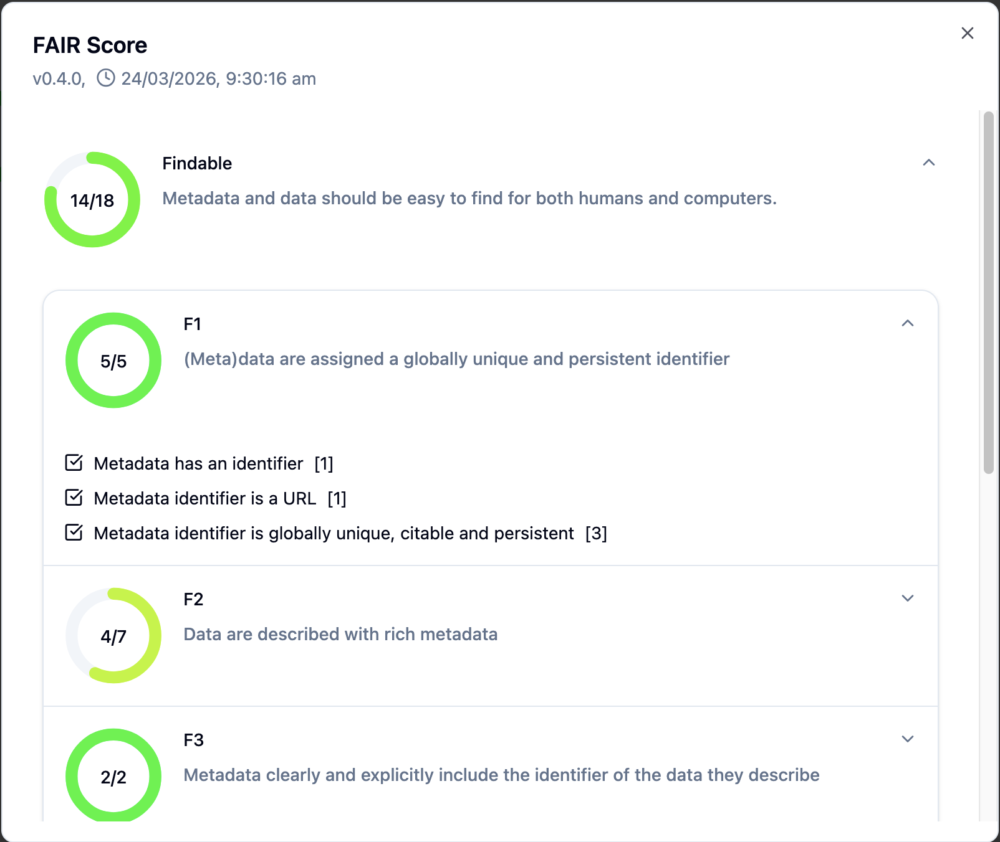

# IDN Score Vue Component Library

## Install
Run (requires GitHub token auth as this package is hosted on GitHub's NPM registry)

```bash
npm install @idn-au/score-component-lib
```

## Use

```vue
<script lang="ts" setup>
import { type TopScoreValueObj } from "@idn-au/score-component-lib";

const scoreData: TopScoreValueObj = {
    "version": "0.3.1",
    "refResource": "https://example.com/example1",
    "created": "2025-05-19T12:08:59",
    "scores": {
        "f": {
            "title": "Findable",
            "description": "Metadata and data should be easy to find for both humans and computers.",
            "value": 15,
            "max": 15,
            "scores": {
                ...
            },
        },
        ...
    },
};
</script>

<template>
    <Scores title="FAIR" :score="scoreData" />
</template>
```





## Development
Install dependencies (requires PNPM):

```bash
pnpm install
```

Run locally:

```bash
pnpm dev
```
